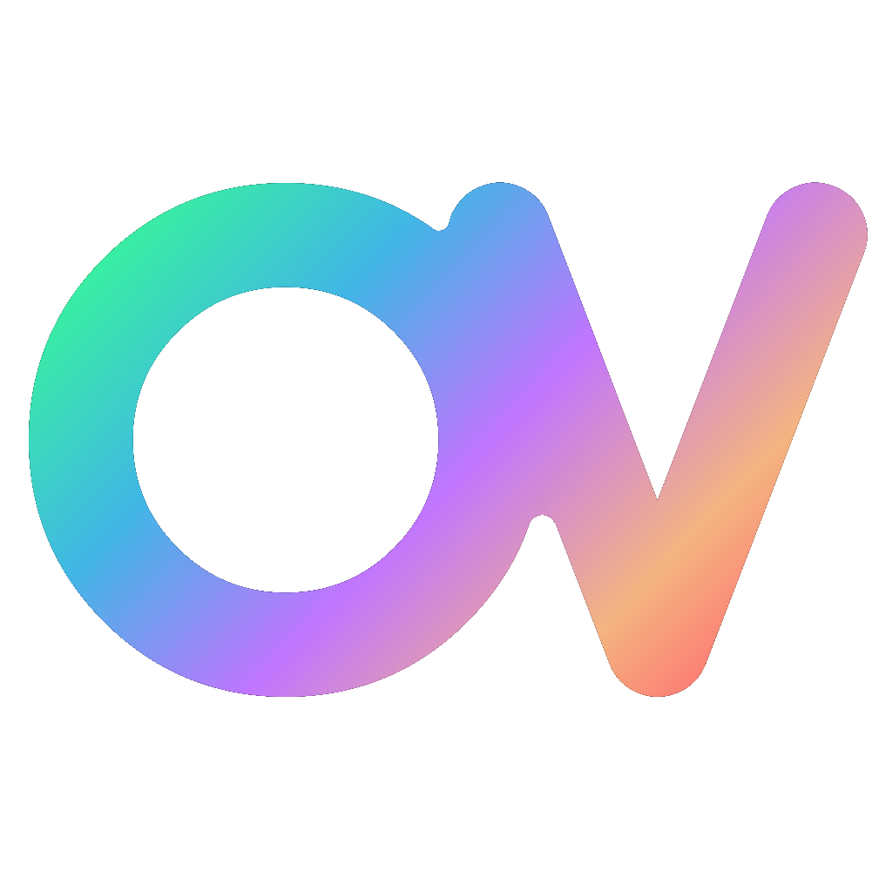

# Open Voxel 🧊
Open Voxel is an **open source voxel engine/editor** written in C++, using GLFW, Vulkan and ImGui.

#### OpenVoxel is currently in development and very far from being usable.

## Road map
- [ ] **0.1.0** - Basic working engine editor.
- [ ] **0.2.0** - Scene system (load/save/edit)
- [ ] **0.3.0** - Editor content browser
- [ ] **0.4.0** - Basic UI system
- [ ] **0.5.0** - Proper scene renderer
- [ ] **1.0.0** - Can publish games
- [ ] **2.0.0** - Physics engine ???

## Links

